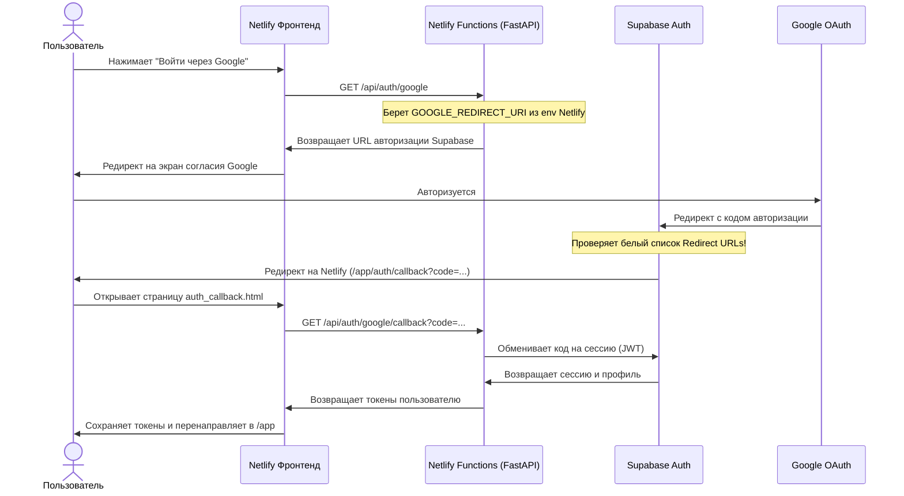

# 🌐 Настройка Google OAuth после деплоя на Netlify

При деплое фронтенда и бэкенда на Netlify, авторизация через Google перестает работать, если в системе остались локальные настройки (`localhost`). 

Для восстановления работы Google-входа необходимо выполнить **три простых шага** в панелях Supabase и Netlify.

---

## 🗺️ Схема работы авторизации в продакшене



---

## 🛠️ Пошаговое руководство по исправлению

### Шаг 1. Настройка разрешенных редиректов в Supabase

Supabase в целях безопасности блокирует перенаправление пользователя на любые сторонние домены (включая Netlify), если они не внесены в белый список.

1. Откройте **[Supabase Dashboard](https://supabase.com/dashboard)** и выберите ваш проект.
2. В левом меню нажмите на иконку шестеренки (или раздел **Authentication** -> **URL Configuration**).
3. Найдите раздел **Site URL** и список **Redirect URLs**:
   * В **Redirect URLs** нажмите **Add URL** и добавьте точный адрес страницы обработки авторизации:
     ```
     https://<ВАШ_САЙТ_НА_NETLIFY>.netlify.app/app/auth/callback
     ```
   * Также рекомендуется добавить общую маску для вашего домена Netlify, чтобы избежать проблем с другими редиректами в будущем:
     ```
     https://<ВАШ_САЙТ_НА_NETLIFY>.netlify.app/**
     ```
4. Нажмите **Save** (Сохранить).

---

### Шаг 2. Настройка переменных окружения в Netlify

Ваши Netlify Serverless Functions (FastAPI бэкенд) при запуске эндпоинта `/api/auth/google` генерируют ссылку редиректа на основе переменной окружения `GOOGLE_REDIRECT_URI`. По умолчанию она настроена на `localhost:8000`.

1. Откройте **[Netlify Dashboard](https://app.netlify.com)** и выберите ваш сайт.
2. Перейдите во вкладку **Site configuration** -> **Environment variables**.
3. Добавьте или измените следующие переменные окружения:
   
   | Переменная | Пример значения | Описание |
   | :--- | :--- | :--- |
   | `GOOGLE_REDIRECT_URI` | `https://<ВАШ_САЙТ_НА_NETLIFY>.netlify.app/app/auth/callback` | Куда Supabase вернет пользователя |
   | `APP_URL` | `https://<ВАШ_САЙТ_НА_NETLIFY>.netlify.app` | Базовый URL приложения |
   | `SUPABASE_URL` | `https://your-project.supabase.co` | URL вашего проекта Supabase |
   | `SUPABASE_KEY` | `eyJhbGciOiJIUzI1Ni...` | Anon/Public ключ Supabase |
   | `DATABASE_URL` | `postgresql://postgres...` | Строка подключения к PostgreSQL |
   | `GOOGLE_CLIENT_ID` | `848967308145-...apps.googleusercontent.com` | ID OAuth клиента Google |
   | `GOOGLE_CLIENT_SECRET` | `GOCSPX-...` | Секрет OAuth клиента Google |

4. **ВАЖНО:** После сохранения переменных окружения Netlify необходимо перезапустить сборку (Deploys -> Trigger deploy -> Clear cache and deploy site), чтобы новые переменные окружения применились к серверным функциям.

---

### Шаг 3. Проверка в Google Cloud Console (Опционально)

Поскольку в нашей схеме авторизацией управляет Supabase, в консоли Google Cloud Console в качестве **Authorized redirect URI** должен быть указан адрес самого Supabase, а не Netlify. 

Убедитесь, что в **[Google Cloud Console](https://console.cloud.google.com)** в настройках вашего OAuth-клиента в поле **Authorized redirect URIs** добавлен адрес:
```
https://<ВАШ_SUPABASE_PROJECT_ID>.supabase.co/auth/v1/callback
```
*(Если вы уже настраивали локальную авторизацию через Supabase, этот пункт у вас уже выполнен и готов к работе).*

---

## 🔍 Как проверить успешность настройки?

1. Откройте ваш сайт на Netlify: `https://<ВАШ_САЙТ_НА_NETLIFY>.netlify.app/app/login`.
2. Нажмите кнопку **"Войти через Google"**.
3. Вас должно перенаправить на страницу авторизации Google.
4. После выбора аккаунта Google должен вернуть вас на страницу `https://<ВАШ_САЙТ_НА_NETLIFY>.netlify.app/app/auth/callback?code=...`.
5. На экране отобразится индикатор *"Завершаем авторизацию..."*, после чего вас автоматически перенаправит в личный кабинет `/app`.
